# Theory

## Introduction ToDo

### History of Programming

- **Non-Structured Programming**

  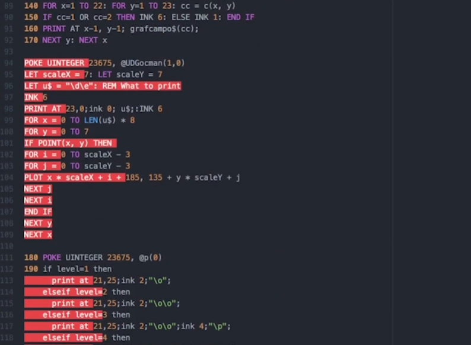

  - 1950
  - Sequentially ordered Instructions
  - Creates "Spaghetti Code" which is complicated code, difficult to understand and maintain

- **Structured Programming**

  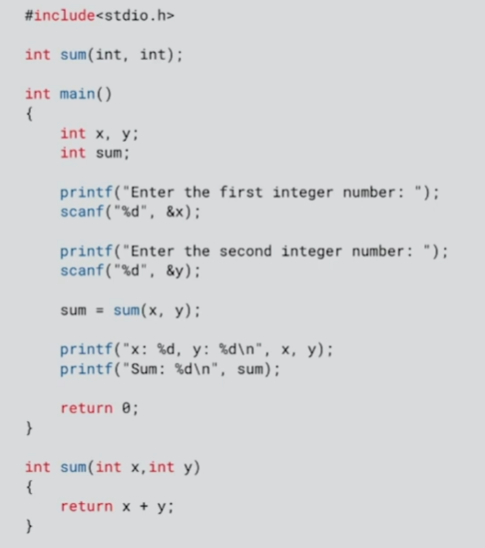

  - 1960
  - Breaks down code into logical steps
  - They rely on sub-routines which contains set of instructions to be carried out
  - Named functions and Data structures improved the readability of the code
  - Reduces development time

- **Object-Oriented Programming**
  - 1980
  - Splits apart the program into self-contained objects
  - Object acts as a program and operates on its own data
  - Objects interact with each other and they can even contain other objects

## Compilers ToDo

- Piece of software that turns our code (C++ or other) into binary code that is executed by the CPU instruction to run our program

## Preprocessing Compilation Linking ToDo

- ToDo

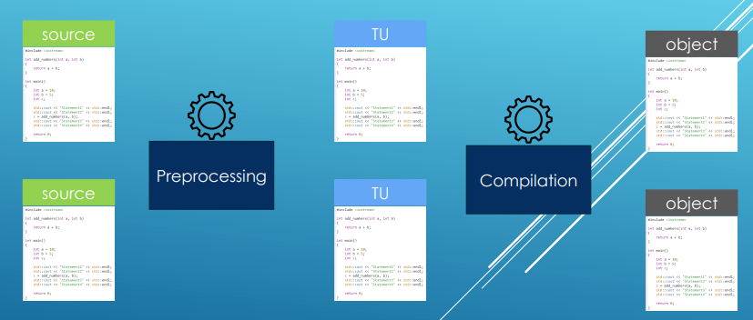

- When we have the object files ready they will be process by linker
- Linker will stich them together and outputs single binary file

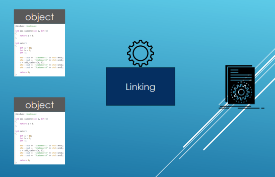

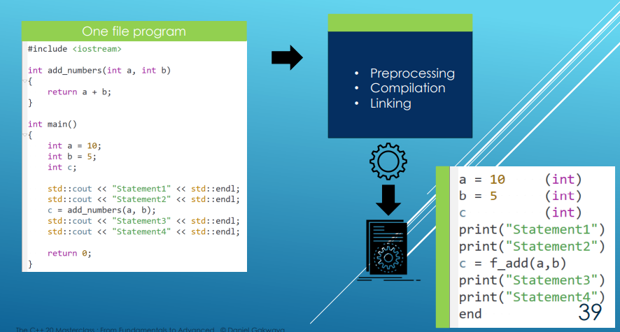

## auto deduction

- If auto will try to deduce type from reference that it wont be reference to the type but just the type that is being referenced

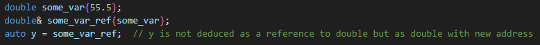

- But it is possible to deduce reference with 'auto&':

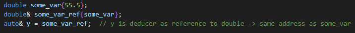

- 'auto&' will also preserve the constness of reference (const reference will stay const reference)
- for naked 'auto' constness does not matter because it will create copy and the copy will not modify original anyway 

## Static variables

- We can define global variable 'static' when we want to use it just within that source file
- Or we can define local variable 'static' when we want to use it more then once without initializing it again when function would be call again
  - Local static variable wont be destroyed when it scopes ends and is initialized only once the first time control passes through their declaration
  - This is known as "lazy initialization" or "on-demand initialization" 
  - That is useful for example if we want to know how many times is some function called etc.

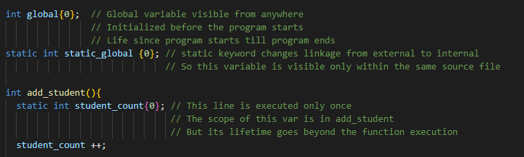

- Both global and static variables have static storage duration
- They live throughout the entire lifetime of the program
- Local static variables can not be used outside of their scope even tho their lifetime goes outside that scope

## Not sure where to put it yet - Random stuff

- Initialization with {} is safer because it will prevent data loss from implicit conversions or at least warn us
  according to used compiler. int x {20.7}; -> warn or error    vs.  int x = 20.7; -> Will convert to x = 20 without warning

## Copying

- Creating an array of some variables will create copy of them
- Same with the range based for loop 

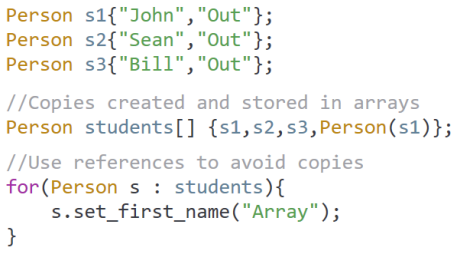

- If we want to avoid copy we can use reference

### Shallow Copy

- Member wise copy of member variables even for pointers.

### Deep Copy

- When pointer member variables are involved, it allocates new memory and copies in data from the source pointer

## Linkages

- Property associated with a name that controls how wide or narrow is the visibility of the name across translation units

### Internal Linkage

- Only visible in the single translation unit
- If we try to declare it in another TU, We will be creating completely new definition

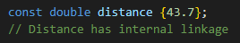

### External Linkage

- Can be accessed and used in different translation units

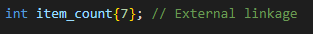

- Global external variables used from other cpp:

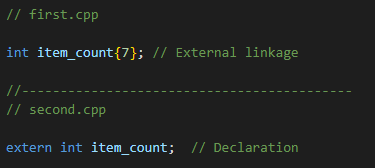

- Use of external linkage for functions:

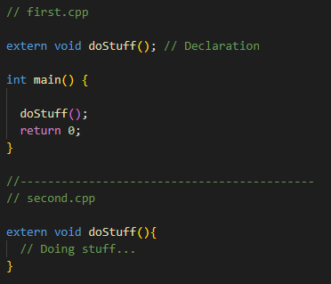

### No Linkage

- Local variable accessible only in the single scope

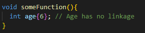

### Module Linkage

### Linkage Defaults

- Function local variables have no linkage
- Const global variables have internal linkage
- Non const global variables have external linkage
- Functions have external linkage
- Static global variable or static function has internal linkage

### Changing linkage

- We can also change the linkage type
- We can use 'extern' to change linkage from internal to external

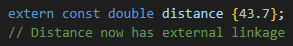

- Also if we want to have function with internal linkage we can mark it as 'static' because static functions have internal linkage

### Linkage vs visibility ToDo

- External Linkage: 
  - The function or variable can be referred to from other TU
- Visibility in TU: 
  - Whether particular TU can see and use given function or variable
  - Governed by includes and physical organization of the code

## Declarations and Definitions

- Declaration - Introduces the name in a file
- Definition - Says what something is or what it does
  
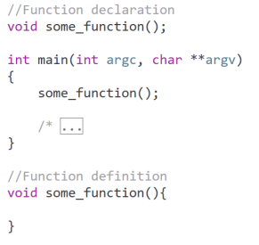

- If we use name but we do not have declaration for it, then we will get compile error
- If we compile with declaration but without definition code compiles, but if we will use the name then we will get linker error
- Declaration are usually in header (there could be even a definition like for classes etc.) so we must include header to have path to the declarations at compile-time
- But we do not need to include files (source files) with only definitions because source files are compiled into object files and object files are linked together
- So while the compiler needs to know about declarations, it is the linker job to connect references to their actual definitions
- Exception are **Templates** where template definitions need to be available at compile-time in every translation unit where they are used.
  - As a result template definitions are often found in header files

### Variables

- For variables it is not very common to separate declaration and definition.

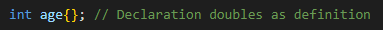

- For some variables like for example static variables inside of classes it is possible to separate declaration and definition
- Here declaration is inside of the class but definition is outside

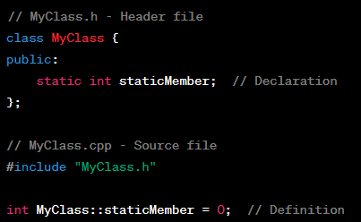

### Functions

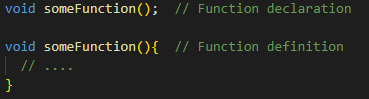

### Classes

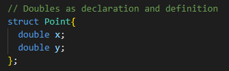

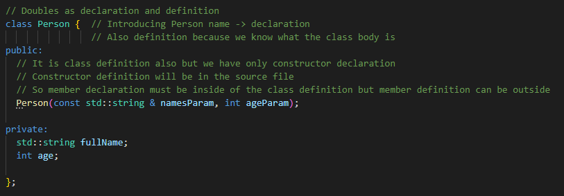

### One Definition Rule (ODR)

- Certain entities can have only one definition within an entire program, even though they can be declared multiple times. 
- Violation of this rule can lead to undefined behavior
- Certain entities like **classes, functions and variables** can be defined only once in any single translation unit and
  if they have linkage (internal or external), they can also be defined only once across the entire program
- Exceptions:
  - **'inline'** functions (including implicitly inline function like class member functions defined within the class definition)
  - **Templates** (because they can be instantiated in multiple translation units)
  - **'constexpr'** variables and functions (since they are implicitly inline)
  - There is also exception for class definitions, that multiple definitions are allowed as long as they are identical (so header of the class can be included multiple times)
    This exception is possible because class definitions does not allocate storage, instead they just describes the blueprint. That is also reason why we need to define static member
    outside of that header file because that would break the ODR.
  
- Implications:
  - If we define a non-inline function in header file and this header file is included in multiple source files, we will violate ODR
  - The same goes for global variables defined in header file
  - To avoid such issues, functions and global variables are typically declared in header and defined in source files.
  - Inline functions and templates which are exceptions are often directly in headers
  - Good practice to have 'include guards' in headers ('#ifndef', '#define', '#endif') or '#pragma once' to ensure that even if header
    is included multiple times in single translation unit, its content is actually processed only once.

### Forward Declaration

- To introduce name in a file (mostly for classes) for cases when we need name but we do not need definition

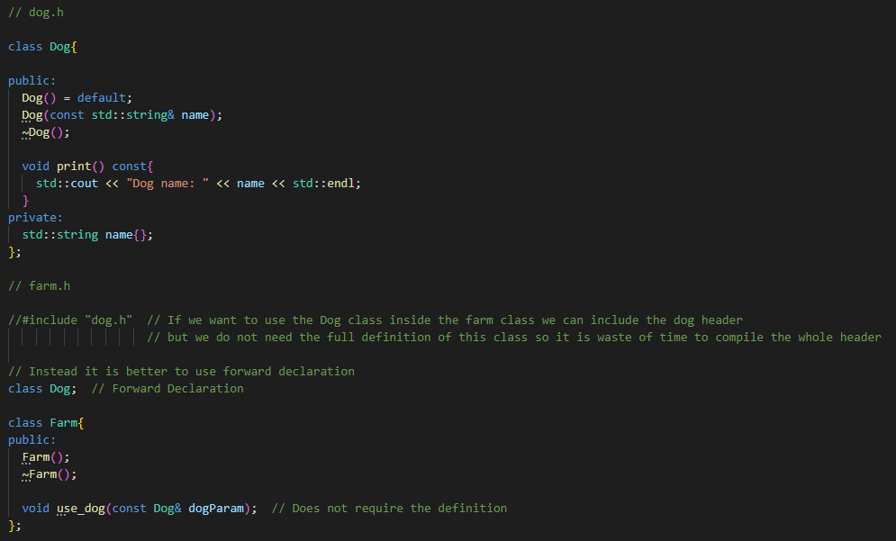

- Another benefit is that if we changed something in the dog header the farm class does not need to be recompiled
  because we do not need the definition
- Works only if we do not need the definition

## Inline Variables and Functions

### Inline Functions

- Introduced to hint the compiler that a function should be inlined
- When function is inlined its function call is replaced with the function body thereby eliminating the overhead of a function call
- Typically the functions definition is provided in header files to make inlining possible across different TU
- By default it has external linkage but the compiler is free to ignore the 'inline' hint and not inline the function
- With inline we can put function definition in header file and we can include it in multiple files
- Useful for header only libraries

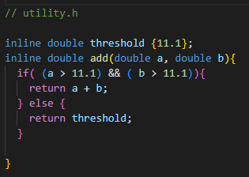

### Inline Variables (C++17)

- To allow variables to be defined in header files
- useful for defining constants or static data members of classes in header file

### Inline with Multiple Files

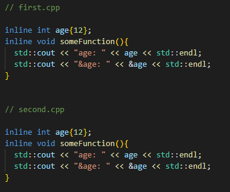

- With 'inline' keyword the compiler will unify functions and variables with the same signature to one so we wont brake ODR
- Without inline we will get compiler error that we have multiple definitions

### Inline vs Static

- Inline will optimize all the definitions for a name into one
- Static or unnamed namespaces will not do such a optimizations

## Computer with Single Processor

### Single Threaded Program

- The program's instructions are loaded from memory
- The instructions are executed on the processor
- Registers store infromation needed to execute the current instruction
  - Stack Pointer
  - Operand Arguments
  - etc.
- Data is loaded from memory into processor registers as needed
- If modified the new value is then written back to the memory

### Multi Threaded Program

- Implemented by "Time Slicing"
- Each thread runs on the CPU for a short time:
  - Tread A starts, runs for a short period, then pauses
  - Tread B starts, runs for a short period, then pauses
  - Tread C starts, runs for a short period, then pauses
  - Thread B runs again from where it left off, then pauses
  - Thread C runs again from where it left off, then pauses
- This is done very quickly
- The threads appear to run concurrently

#### Thread Scheduler

- A scheduler controls how threads execute
- Pre-emptive task switching
  - A thread can run for a certain time
  - The schedular will interrupt the tread when it has used up its time slot
  - Another thread can then run
  - The schedular will make interrupted thread "sleep"
- Threads may start in any order
- A thread may be interrupted at any time
- A thread may be restarted at any time
- While thread is sleeping another thread may run
  - This can run the same code as the inactive thread
  - It can access data which it shares with the inactibe thread

#### Time Slicing Disadvantages

- Reqiuires a "Context Switch"
- Save the processor state for the current thread
  - Current values of processor registers
  - Program's instruction pointer
  - etc.
- Load the saved processor state for the next thread
  - Values of processor registers when stopped etc.
  - May also have to reload the thread's instructions and data
- The processor can not execute any instructions during the context switch

## Computer with Multiple Processors

