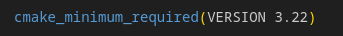
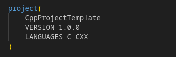
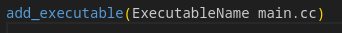
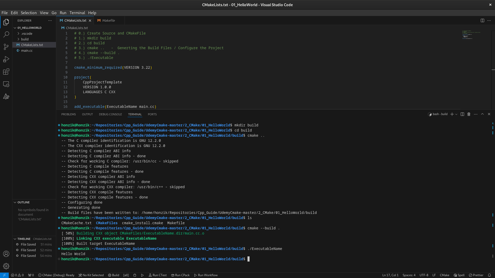
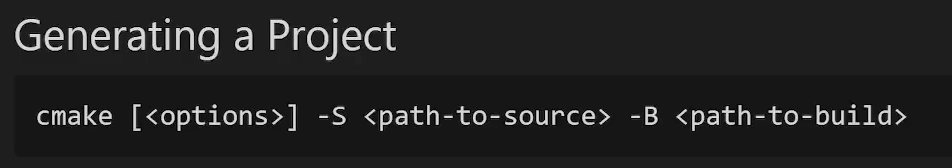
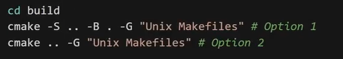

# Tooling

## CMake

- Tool that will use some certain generator and then it creates a build file based on the generator
- In the build file is the build system that contains list of all compiler commands that are needed 
- Benefit of using **CMake** is that we do not have to care about these different build systems (Ninja, Makefile, Virtual Studio solution, etc...)
- We are just using **CMake** and **CMake** will to that under the hood for us

- **CMakeLists.txt**

  - **cmake_minimum_required()**
    - We can define the minimum required CMake version with this function

      

  - **project()**
    - We can define name of the project
    - Also we can define current version of the project
    - We can define permitted languages for the project as well
    - We write CXX instead of C++ because + would be an operator

      

  - **add_executable()**
    - Add an executable to the project using the specified source files
  
      

- **Run CMake**
  - **Command Line**
  
    1.  Create Source File and CMakeFile
    2.  mkdir build       
          - Create folder for build
    3.  cd build
          - Go to that folder
    4.  cmake ..          
          - Generates the build files / Configures the project
          - Creates **CMakeCache.txt**, **cmake_install.cmake**, **Makefile**, **CMakeFiles** 
    5.  cmake --build .   
          - Starts compilation
    6.  ./ExecutableName  
          - Runs the executable

      

    - **cmake**
    
      - We can also do some customization of the source and build paths
      
        

      - To see all build systems that are available on our system just type **cmake --help** into the terminal
      - To select some specific build system:
        
        

              

  - **VS Code extension**