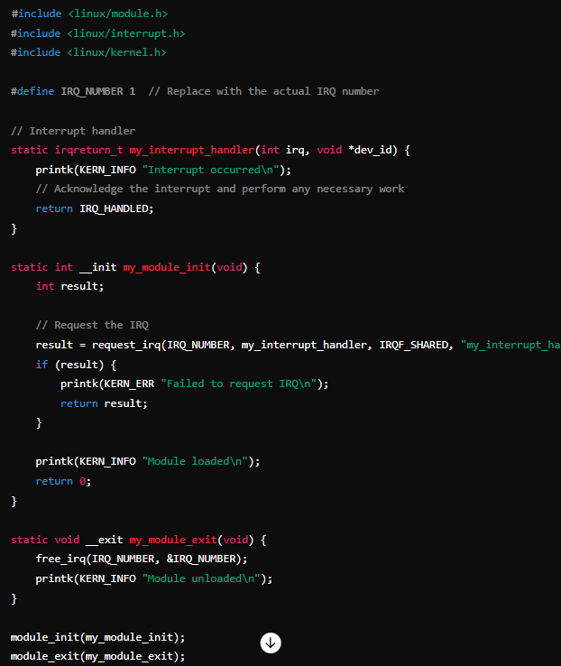
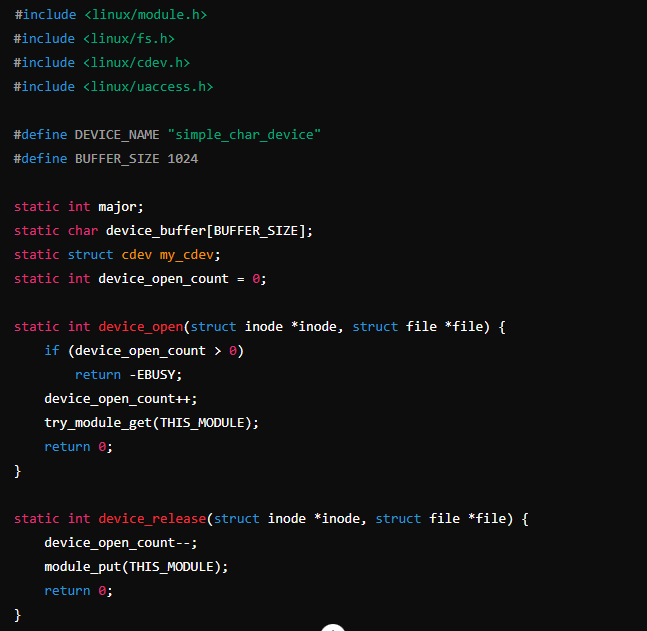
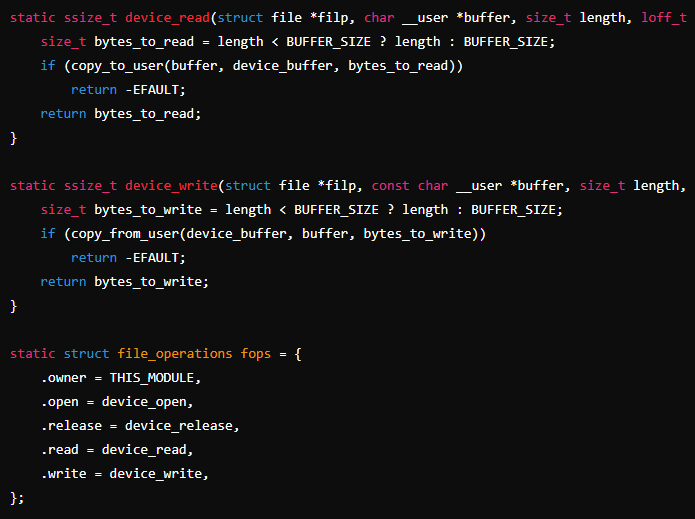
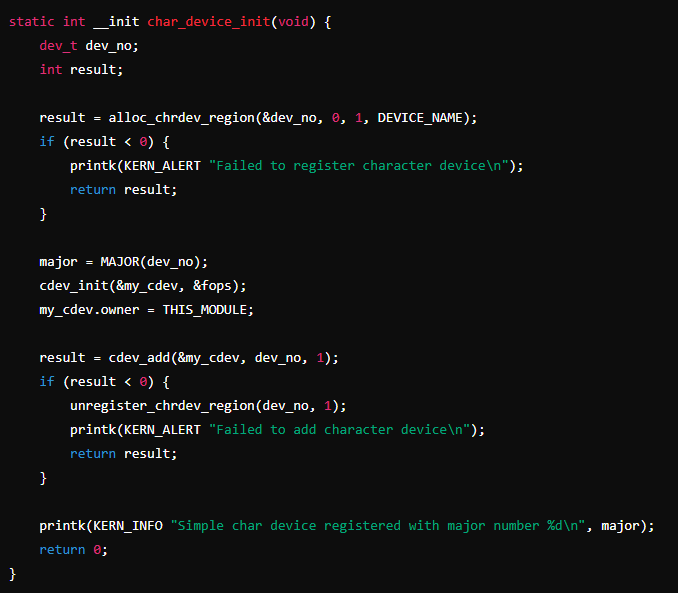
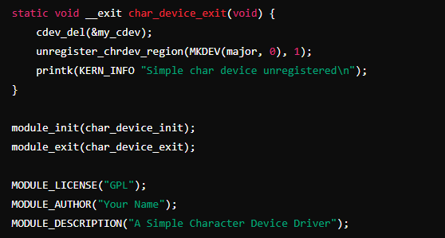

# InterView

## ChatGPT structure 

Sure, I can help you prepare for the interview. Let's break it down into a few key areas: understanding the company, understanding the role, technical preparation, and typical interview questions.

Understanding the Company
Research TurboNext.AI:
Learn about their products, goals, and market position.
Understand their competition and how they differentiate themselves.
Familiarize yourself with their patents and any published research or whitepapers.
Understanding the Role
Role Requirements:
Proficiency in C/C++ or similar languages.
Experience with hardware components like FPGAs and GPUs.
Understanding computer architecture and system-level programming.
Experience with CUDA and OpenCL for GPU programming.
Driver development for Linux environments.
Familiarity with ML concepts like LLMs and CNNs.
Technical Preparation
Core Concepts:
C/C++ Proficiency: Review language features, memory management, multi-threading, and debugging techniques.
Hardware Components: Understand how FPGAs and GPUs work, their use cases, and how they interface with software.
Computer Architecture: Revise fundamentals like CPU/GPU architectures, memory hierarchies, and bus systems (like PCIe).
System-Level Programming: Concepts such as interrupts, I/O operations, DMA, and low-level device management.
CUDA/OpenCL: Basics of GPU programming, parallel computing paradigms, and performance optimization.
Linux Driver Development: Kernel modules, driver APIs, handling hardware interrupts, and debugging in Linux.
Typical Interview Questions
Technical Questions:

C/C++: Explain memory management techniques in C/C++. Write a program to demonstrate multi-threading.
FPGAs/GPUs: Describe an FPGA and its applications. How would you interface an FPGA with a CPU? Explain how GPUs are utilized for parallel processing.
Computer Architecture: Explain the difference between Harvard and von Neumann architectures. Describe the PCIe bus and its advantages.
System-Level Programming: How do you handle hardware interrupts in Linux? Describe a DMA and its benefits.
CUDA/OpenCL: Write a simple CUDA program to add two vectors. Explain how you optimize GPU code.
Linux Driver Development: How do you write a Linux device driver? Explain the process of handling I/O operations in a driver.
Behavioral Questions:

Describe a challenging project you worked on and how you overcame the difficulties.
How do you approach debugging complex software issues?
Explain a time when you had to learn a new technology quickly.
Scenario-Based Questions:

How would you design a system to efficiently manage data transfer between an FPGA and a GPU?
Given a performance bottleneck in a data pipeline, how would you identify and address the issue?
Practice Interview Questions
Technical Practice:

C/C++:

Write a C++ program that manages dynamic memory allocation and deallocation.
Explain how a mutex works and write a sample program using pthreads to demonstrate thread synchronization.
Hardware Components:

Describe the steps required to interface an FPGA with a CPU using PCIe.
Explain how GPU acceleration works and give an example use case.
System-Level Programming:

How would you implement a ring buffer in C?
Describe the process of writing a kernel module in Linux.
CUDA/OpenCL:

Write a simple CUDA kernel to perform matrix multiplication.
Discuss the differences between CUDA and OpenCL and their respective advantages.
Linux Driver Development:

Describe the lifecycle of a Linux device driver.
How would you debug a kernel panic caused by a device driver?
Behavioral Practice:

Describe a time when you had to work closely with hardware engineers to solve a problem. What was the problem and how did you resolve it?
Explain a situation where you had to quickly get up to speed with a new technology or tool. How did you manage your learning process?
Additional Resources
Books:

The C++ Programming Language by Bjarne Stroustrup
Computer Architecture: A Quantitative Approach by John L. Hennessy and David A. Patterson
Programming Massively Parallel Processors: A Hands-on Approach by David B. Kirk and Wen-mei W. Hwu
Linux Device Drivers by Jonathan Corbet, Alessandro Rubini, and Greg Kroah-Hartman
Online Courses:

Coursera: Parallel Programming (CUDA)
edX: Embedded Systems (FPGA)
Udacity: Advanced C++

## FPGA vs GPU

### FPGA

- **F**ield **P**rogrammable **G**ate **A**ray
- Integrated circuit that can be configured by the customer or designer after manufacturing hence field programmable
- They are composed of an array of programmable logic blocks and a hierarchy of reconfigurable interconnects allowing the blocks to be wired together
- Logic blocks can be configured to perform complex combinational functions or merely simple logic gates like AND and XOR
- In the most FPGAs the logic blocks also include memory elements which may be simple flip flops or more complete blocks of memory
- **Application**
  - Digital Signal processing - Due to their ability to handle complex mathematical computations in parallel
  - Prototyping ASICs
  - Cryptography
  - Network Processing - Used in routers, switches, and other network devices to process data at high speeds
  - Medical Imaging - Employed in CT scans and MRIs for processing large amounts of data in real-time
  - Industrial Automation

- **Interfacing FPGA with CPU**
  - **PCIe (Peripheral Component Interconnect Express)**
    - PCIe is a high speed interface standard for connecting components
    - FPGAs can be connected to CPU using PCIe allowing for high speed data transfer
    - The FPGA would include a PCIe endpoint block to interface with the CPU PCIe root complex. This allows the FPGA to appear as PCIe device on the CPUs bus
    - **Driver Development**
      - Write a device driver for the operating system that handles communication data transfers, interrupts, and memory mappings
  
  - **Memory-Mapped I/O**
    - Allows FPGA to be mapped into the CPU address space
    - Configure the FPGA to expose specific registers or memory ares to the CPU. CPU can then read from and write to these areas as if they were normal memory addresses
    - **Driver Development**
      - Develop a driver that maps these memory addresses into the user space, allowing software applications to interact with the FPGA directly
  
  - **AXI (Advanced eXtensible Interface)**
    - Part of the ARM Advanced Microcontroller Bus Architecture specification and is widely used for connecting components in Systems on Chips
    - The FPGA would act as a slave or master device on the AXI bus interfacing with the CPU

  - **UART (Universal Asynchronous Receiver-Transmitter)**
    - Simpler method for communication often used for debugging or low speed data transfer
    - The FPGA and CPU would each have UART interface and they would communicate via serial communication

  - **Code Example**

- **Interfacing an FPGA with a CPU**

  - **Memory-Mapped I/O**
    - The FPGA is mapped into the CPU's address space.
    - The CPU can read from and write to the FPGA as if it were accessing memory.
    - Commonly done through buses like AXI (Advanced eXtensible Interface) in ARM-based systems.
  
  - **Peripheral Component Interconnect (PCI) or PCI Express (PCIe)**
    - FPGAs can be interfaced with the CPU via PCI or PCIe slots.
    - This method is typically used in high-performance computing applications.

  - **GPIO (General-Purpose Input/Output)**

    - Simple interfacing using GPIO pins for basic control and data transfer.
    - Limited bandwidth compared to other methods.

  - **High-Speed Serial Interfaces**

    - Interfaces like USB, Ethernet, or custom high-speed serial protocols.
    - Used for applications requiring high data throughput.

### GPU

- **Architecture**
  - GPUs consist of a large number of smaller, more efficient cores designed for handling multiple tasks simultaneously. 
  - While a CPU might have a few powerful cores optimized for sequential processing, a GPU has thousands of smaller cores optimized for parallel tasks.

- **SIMD (Single Instruction, Multiple Data)** 
  - GPUs leverage SIMD architecture, where a single instruction operates on multiple data points concurrently. 
  - This is ideal for tasks like image processing, matrix multiplication, and scientific simulations where the same operation needs to be applied to a large dataset.

- **CUDA (Compute Unified Device Architecture)** 
  - Developed by NVIDIA, CUDA is a parallel computing platform and application programming interface (API) that allows developers to use NVIDIA GPUs for general-purpose processing (an approach known as GPGPU, General-Purpose computing on Graphics Processing Units). 
  - It extends the C programming language with keywords and constructs that help in defining parallel tasks and managing GPU memory.

- **OpenCL (Open Computing Language)**
  - OpenCL is an open standard for cross-platform, parallel programming of diverse processors. 
  - It enables the use of GPUs, CPUs, FPGAs, and other processors for a wide range of parallel computing tasks.

## Architecture

### CPU Architecture

- **Basic CPU Components**

  - **ALU (Arithmetic Logic Unit)** 
    - The ALU performs arithmetic and logical operations. 
    - It's a critical part of the CPU where actual computation takes place.
  
  - **Registers**
    - Registers are small, fast storage locations within the CPU. 
    - They hold data and instructions that the CPU needs immediately.

  - **Control Unit** 
    - The control unit directs the operation of the processor. 
    - It tells the ALU, memory, and I/O devices how to respond to the instructions that have been sent to the processor.
  
  - **Cache** 
    - Cache is a small amount of very fast memory located inside or very close to the CPU. 
    - It stores copies of the data from the most frequently used main memory locations.
    
- **CPU Pipeline**

  - **Fetch** - Retrieve an instruction from memory.
  - **Decode** - Translate the instruction into signals that control other parts of the CPU.
  - **Execute** - Perform the operation specified by the instruction.
  - **Memory Access**  - Read from or write to memory if the instruction requires it.
  - **Write Back** - Store the result of the operation back into a register.

### GPU Architecture

- **Basic GPU Components**

  - **Streaming Multiprocessors (SMs)** 
    - SMs consist of many smaller, simpler cores designed for parallel processing. 
    - Each SM can execute thousands of threads simultaneously.
  - **Global Memory** 
    - A large memory space accessible by all SMs, used for general data storage.
  - **Shared Memory** 
    - Fast, limited memory that can be shared among the cores within an SM.
  - **Texture and Constant Memory** 
    - Specialized types of memory optimized for specific types of data access patterns.

- **Parallel Processing**

  - **SIMD (Single Instruction, Multiple Data)** 
    - This architecture allows a single instruction to be executed on multiple data points simultaneously. 
    - It's the basis for many parallel processing tasks.
  - **SIMT (Single Instruction, Multiple Threads)**
    -  NVIDIA's architecture where a group of threads (a warp) executes the same instruction simultaneously.
  

### Memory Hierarchies

- **Cache Levels**

  - **L1 Cache**
    - The smallest and fastest cache, located closest to the CPU cores. 
    - It is often divided into an instruction cache (L1i) and a data cache (L1d).
  
  - **L2 Cache** 
    - Larger and slower than L1, but still faster than main memory. It is often shared among multiple cores.
  
  - **L3 Cache** 
    - Even larger and slower, shared across all cores in a CPU.

- **Main Memory (RAM)**

  - Main memory is volatile memory where the CPU stores data that is actively used or processed. 
  - DRAM (Dynamic RAM) is the most common type of main memory.
  
- **Storage:**

   - Non-volatile memory such as SSDs (Solid State Drives) or HDDs (Hard Disk Drives) is used for long-term data storage.

- Caches (L1, L2, L3) provide increasingly larger but slower storage close to the CPU cores. 
- Main memory (RAM) is larger and slower than cache, used for actively processed data. 
- Storage (SSDs/HDDs) is used for long-term data storage.

- **Bus Systems (PCIe)**

- **PCIe (Peripheral Component Interconnect Express)**

  - PCIe is a high-speed interface standard used to connect various hardware components like GPUs, SSDs, and network cards to the motherboard.
  - **Lanes** 
    - PCIe connections consist of lanes, each containing two pairs of wires (one for sending and one for receiving data). 
    - Common configurations are x1, x4, x8, and x16, indicating the number of lanes.
  - **Versions** 
    - PCIe versions (e.g., PCIe 3.0, 4.0, 5.0) denote the speed and bandwidth improvements. 
    - For instance, PCIe 4.0 doubles the bandwidth per lane compared to PCIe 3.0.

## Computer Architecture 

- Explain the difference between Harvard and von Neumann architectures. Describe the PCIe bus and its advantages.

## C/C++

- Explain memory management techniques in C/C++. Write a program to demonstrate multi-threading.
  
- **Static Memory Allocation**

  - Memory is allocated at compile-time
  - global variables, static variables, arrays
  - **Global Variables**
    - Declared outside any function
    
- **Automatic Memory Allocation**

  - Memory is allocated on the stack at runtime
  - Local variables within functions

- **Dynamic Memory Allocation**

  - Memory is allocated on the heap at runtime
  - Requires manual allocation and deallocation using **new** and **delete**

## FPGAs/GPUs 

- Describe an FPGA and its applications. How would you interface an FPGA with a CPU? Explain how GPUs are utilized for parallel processing.

### FPGA

## System-Level Programming 

- **Synchronous I/O** - The request waits until the operation completes.
- **Asynchronous I/O** - The request returns immediately, and the operation completes in the background.

- **Using Semaphores for Concurrency**
  - std::sem_t sem;
    sem_init(&sem, 0, 1);
    sem_wait(&sem);  // Decrement the semaphore
    // Critical section
    sem_post(&sem);  // Increment the semaphore

- How do you handle hardware interrupts in Linux? Describe a DMA and its benefits.

- **Handling Hardware Interrupts in Linux**
  - Handling hardware interrupts in Linux involves writing an interrupt handler, also known as an interrupt service routine (ISR). 
  - This is a function that the kernel calls when a specific hardware interrupt occurs. 
  - Here is a step-by-step guide on how to handle hardware interrupts:

  - **Registering an Interrupt Handler:**

    - Use the **request_irq** function to register an interrupt handler.
    - The request_irq function takes several parameters, including the interrupt line number, the handler function, flags, the device name, and a device-specific data pointer.

  - **Writing the Interrupt Handler:**

    - The interrupt handler function should perform minimal work and execute quickly.
    - Typically, the handler acknowledges the interrupt and then schedules any further processing to be done later, often in a bottom half handler (e.g., a tasklet or workqueue).

  - **Freeing the Interrupt:**

    - Use the **free_irq** function to release the interrupt when it is no longer needed, such as during module cleanup.

    

## CUDA/OpenCL

- **CUDA vs OpenCL**
  
  - CUDA is specific to NVIDIA GPUs and offers a more straight forward programming model
  - OpenCl is an open standard that supports multiple types of devices including GPUs from different vendors
  - 

### CUDA

- Write a simple CUDA program to add two vectors. Explain how you optimize GPU code.
- CUDA is parallel computing platform and programming model developed bz NVIDIA for general computing on GPUs
- It allows developers to use the GPU for parallel processing tasks

- **Optimizing with CUDA**
  - Identify parallelizable parts of the task
  - Minimize memory transfer between CPU and GPU
  - Use shared memory effectively
  - Optimize kernel launch configurations (dimensions etc...)
  
- **Memory Management in CUDA:** 
  - CUDA uses different types of memory such as global, shared, constant, and local memory. 
  - Global memory is the largest and slowest, while shared memory is faster and limited to threads within the same block.

- **Kernel and Warp:** 
  - A kernel is a function that runs on the GPU
  - Warp is a group of 32 threads that execute instructions in lockstep.

## Linux Driver Development

- How do you write a Linux device driver? Explain the process of handling I/O operations in a driver.

## Memories

### Virtual Memory

- Virtual memory is a memory management technique that provides an abstraction of physical memory
- It allows programs to use more memory than what is physically available by using disk space to extend RAM
- Virtual memory enables processes to use a continuous address space, simplifies memory management, and provides isolation between processes
- It allows the operating system to move data between physical memory (RAM) and disk storage (swap space) as needed.

- **Paging:**

  - Virtual memory relies on paging, where data is moved between physical memory and disk storage. 
  - Paging can introduce performance overhead, especially if there is frequent swapping (thrashing).

- **Page Faults:** 

  - A page fault occurs when a program accesses a part of memory that is not currently mapped to physical memory. 
  - The OS handles it by loading the required page from disk into RAM.

### Direct Memory Access DMA

  - DMA allows peripheral devices to access the main memory directly, bypassing the CPU
  - That improves data transfer speed and frees up the CPU
  - It is a feature that allows certain hardware subsystems to access main system memory (RAM) independently of the CPU. 
  - This means that data can be transferred between memory and a device without burdening the CPU with the data transfer tasks.
  - By offloading data transfer tasks to DMA controllers, the CPU is free to perform other tasks, improving overall system efficiency.
  - DMA can transfer data at higher speeds compared to CPU-driven data transfers because it avoids CPU overhead.
  - Using DMA reduces the number of CPU cycles required for data transfers, which is particularly beneficial in high-throughput systems or real-time applications.
  - Allows concurrent data transfers and CPU operations, leading to better system performance and responsiveness.

## Device Drivers

- **Types**
  - **Character Driver**
    - 
  - **Block Driver**
  - **Network Driver**

- When you compile a Linux device driver, you will get a kernel module, which is a binary file with a .ko (kernel object) extension. 
- This kernel module can be loaded into the Linux kernel to add new functionality, such as supporting a new hardware device.

- **Purpose of Device Driver**
  - Intermediary between OS and the device
  - Enabling OS to communicate with hardware without needing to know its details
- **Kernel Communication with HW**
  - Via device drivers, which handle the specific protocols and commands requires by the hardware

- **Data transfer between CPU and FPGA**
  - Can be achieved using interfaces like PCIe where the CPU sends data to an FPGA memory buffer for processing and retrieves the results

- **Writing and loading a simple character device driver**
  - Write the code to handle open, read, write and release operations
  - Compile the driver and load it using **insmod**
  - Create

  
  
  
  

  - The static keyword in C indicates that the function or variable has internal linkage, meaning it is only visible within the file where it is declared. This is particularly important in kernel module programming for the following reasons:

    - Encapsulation: By making functions static, you ensure that they cannot be accessed or called from other files. This helps in encapsulating the functionality within the module and prevents naming conflicts with other parts of the kernel or other modules.
    - Namespace Management: The Linux kernel is a large and complex system with many contributors. Using static reduces the risk of name collisions with symbols (functions or variables) from other modules or parts of the kernel. 
    - Memory Management: The kernel has limited memory, and unnecessary exposure of symbols can lead to inefficient use of memory. By marking functions and variables as static, you ensure they are not added to the global symbol table, thus saving memory.

- **Debugging a Kernel Module**
  - We can use **printk** or **dmesg** or tools like **gdb**

- **Steps to write and Load Linux Kernel Module**
  - Write the module in C
  - Create **makefile** to compile the module
  - Compile the module using **make**
  - Load the module using **insmod**
  - Verify the module is loaded using **lsmod**
  - Unload the module using **rmmod**

## PCIe

- 

/t/t/t/t/t/t/t/t/t/t/t/t/t/t

Behavioral Questions:

Describe a challenging project you worked on and how you overcame the difficulties.
How do you approach debugging complex software issues?
Explain a time when you had to learn a new technology quickly.
Scenario-Based Questions:

How would you design a system to efficiently manage data transfer between an FPGA and a GPU?
Given a performance bottleneck in a data pipeline, how would you identify and address the issue?
Practice Interview Questions
Technical Practice:

C/C++:

Write a C++ program that manages dynamic memory allocation and deallocation.
Explain how a mutex works and write a sample program using pthreads to demonstrate thread synchronization.
Hardware Components:

Describe the steps required to interface an FPGA with a CPU using PCIe.
Explain how GPU acceleration works and give an example use case.
System-Level Programming:

How would you implement a ring buffer in C?
Describe the process of writing a kernel module in Linux.
CUDA/OpenCL:

Write a simple CUDA kernel to perform matrix multiplication.
Discuss the differences between CUDA and OpenCL and their respective advantages.
Linux Driver Development:

Describe the lifecycle of a Linux device driver.
How would you debug a kernel panic caused by a device driver?
Behavioral Practice:

Describe a time when you had to work closely with hardware engineers to solve a problem. What was the problem and how did you resolve it?
Explain a situation where you had to quickly get up to speed with a new technology or tool. How did you manage your learning process?