# 1 hour Assignment

## Questions

### STL containers

1. **What will be the result of using Key class as a key in std::unordered_map<Key,std::string, KeyHasher, KeyEqual> unordered_map?**

  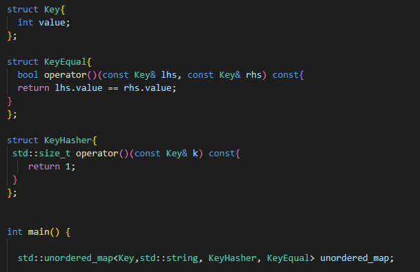

   - **Key Struct:** Contains an integer value that will be used as Key in our map.

   - **KeyEqual Functor:**

     - Compares two Key objects for equality based on the value field.
     - This is correctly implemented and will ensure that two Key objects are considered equal if their value fields are equal.
     - We will use this functor as **Binary Predicate** that will be used by our map to know if two keys are equal or not

   - **KeyHasher Functor:**

     - Unary Functor that takes object **Key** as input and should return unique Hash but here it always return 1, which means every Key object, irrespective of its value, will produce the same hash value.
     - This is a valid implementation but highly inefficient. Since the hash function returns the same value for every key, all entries will be placed in the same bucket. 
     - This degrades the performance of the unordered_map, turning it from an average-case O(1) time complexity for lookups, insertions, and deletions to an average-case O(n) time complexity, as each operation will involve traversing a list of all elements.
  
   
   - **Result of Usage:**

     - The unordered_map will function correctly in terms of mapping keys to values. You'll be able to insert, find, and delete key-value pairs.
     - The KeyEqual will ensure that two keys with the same value are considered equal, and thus you won't have duplicate keys in terms of their value.
     - However, because the KeyHasher returns a constant value, the performance benefits of using an unordered_map are lost. The data structure will essentially behave like a list, with all the elements hashed to the same bucket. This means that operations like insertion, deletion, and lookup will have linear time complexity.
     - If we want to optimize the hash function, we should return a hash based on the key's actual value, for example, by directly returning the value or using a standard hash function like **std::hash<int>()(k.value)**

   - **Answers**:

     - Amortized complexity of insert/search operations is O(1)
     - **Amortized complexity of insert/search is O(n)**   This is the right answer because all values will be in the same bucket so from Hash table we get just List
     - Runtime error

   - **Solution**

  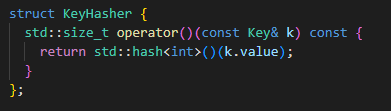

### Functions

2. **Which answer is correct?**

  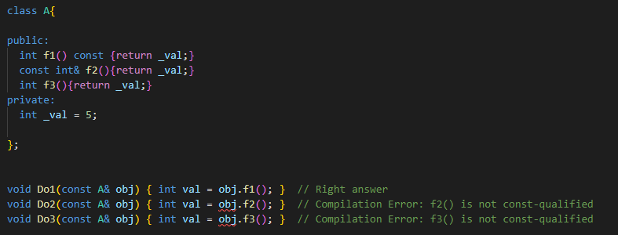

   - **int f1() const**

     - This function returns an int copy of _val and is a const member function
     - Which means it promises not to modify any member variables of the class and can be called on a constant object. 
     - Since obj is a constant reference, you can safely call this function.

   - **const int& f2()** 
     - This function returns a const reference to _val. 
     - However, this function itself is not marked as const, meaning it has the potential to modify the object's state and therefore cannot be called on a constant object like obj. - - Attempting to call f2 on obj will result in a compilation error because it violates the const-correctness rules of C++.

   - **int f3()** 
     - This function returns an int copy of _val and is not a const member function. 
     - Like f2, it cannot be called on a constant object, so attempting to use f3 in this context will also result in a compilation error.

### Polymorphism

3. **What will be printed?**

  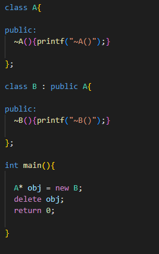

   - There is a potential issue with the destruction process due to the lack of a virtual destructor in the base class A. 
   - When we delete an object through a pointer to a base class, we should have a virtual destructor in the base class to ensure that the derived class's destructor is called. 
   - Otherwise, we will encounter undefined behavior, which often means that only the base class destructor will be executed, and the derived class destructor will be ignored. This can lead to resource leaks if the derived class is managing resources that need to be released in its destructor.

   - **Answer**
     - Without virtual destructor, only ~A() will be printed
     - The output occurs because the destructor of the base class A is not virtual, so when we delete an object of type B through a pointer  to A the destructor of B is not called
     - To ensure that both destructors are called in the right order we should declare the destructor in A as **virtual**

### MultiThreading

4. **What will be printed?**

  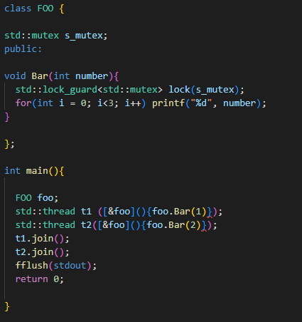

   - The first thread that will call the **Bar()** function will lock the code so the other thread can not use it till the thread will finish execution
   - But due to the concurrent nature of the program it can vary which thread will reach the function first
   - The order depends on the scheduling of the threads, so the output could be: **111222** or **222111**

### Network Programming

5. **TCP - Which statements are true?**

  - **A connection needs to be established before transferring data - TRUE**
  - **Lost packets will be resend - TRUE**
  - **Client applications receive bytes sequentially preserving the original sending order - TRUE**
  - **Packets are encrypted - FALSE**
    - TCP itself does not provide encryption. Encryption is implemented at higher layers witch TLS/SSL in HTTPS
  - **One packet can be addressed to multiple receivers - FALSE**
    - TCP connections are point-to-point -> Each connection is between a single sender and single receiver
    - For sending data to multiple receivers, protocols like UDP in conjunction with multicast can be used

### Throw in Constructor?

6. **Throw**

## Coding

### String

1. **Find the maximum sequence of identical characters**

   - Given a string of ascii characters you need to implement method Algorithm::FindMaxSubstringLength(const char* str) so it returns the maximum sequence of identical characters in str string  
   - **Example:** 
     - abbbcc =3      
     - aabbccaaaa= 4

   - **Solution that I submitted:**

   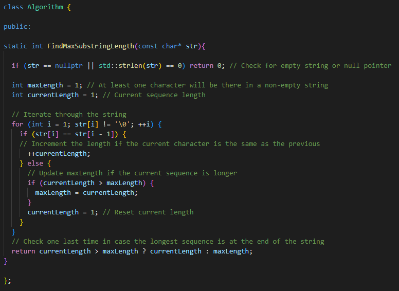

   - **Solution with for_each:**

   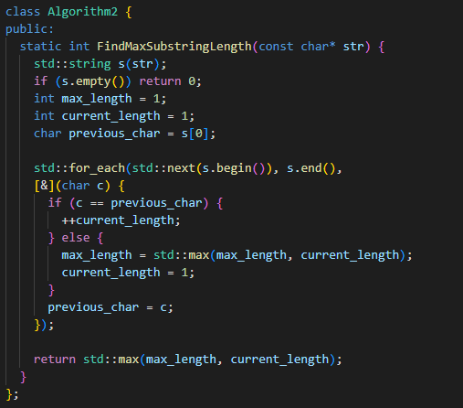

   - **I guess the best solution:**

   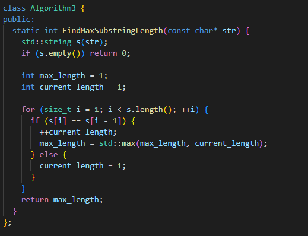

  

3. **Convert string argument to int**

   - Implement the function **Convert::StrToInt(const char* str)** which converts the string argument str to an Integer(int)
   - Try to implement the most efficient function using minimum of CPU and memory
   - Try to handle all the possible input data,valid or invalid
   - Please do not use STL/C library functions and data structures 

   - **Requirements**

     - functions shall validate the string contains only a valid base-10 integer
     - Integer may be preceded with a sign specifier '-'
     - function shall return 0 in case of any error

   - **Example**

     - StrToInt("100") == 100
     - StrToInt("   100") == 0
     - StrToInt("123asd") == 0
     - StrToInt("-123") == 123

  - **Solution that I submitted:**

  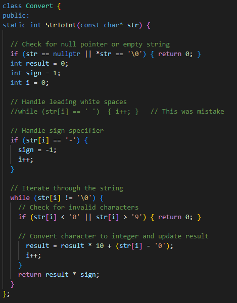

  - **Solution with Overflow and Underflow check**

  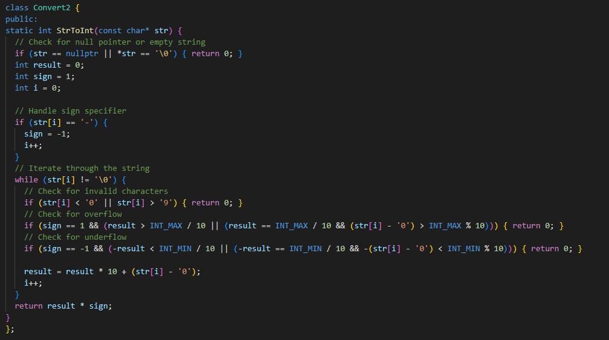

  - **Solution with STD use** - ToDo

### Stack

2. **Stack with memory leak**

   - the current stack implementation has a memory leak issue that needs to be addressed
   - the task is to fix the implementation
   - please do not use STL data structures to replace the current stack implementation

   - **Current implementation:**

template<typename TValue>
class MyStack
{
public:
using TValuePtr = TValue*;

MyStack(std::size_t initialCapacity) : mElements (new TValuePtr[initia])

}

### MultiThreading

4. **Concurrent printing** 

   - These are two threads which print number to the console
   - The first thread prints only odd numbers : 1,3,5,7
   - The second thread prints only even number: 2,4,6,8

  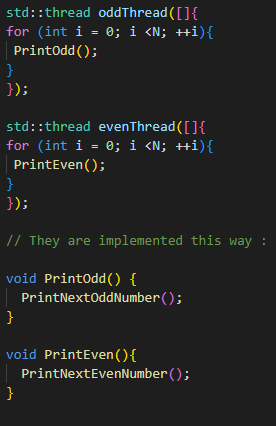

Implement the synchronization of these functions so that number will be printed ascending

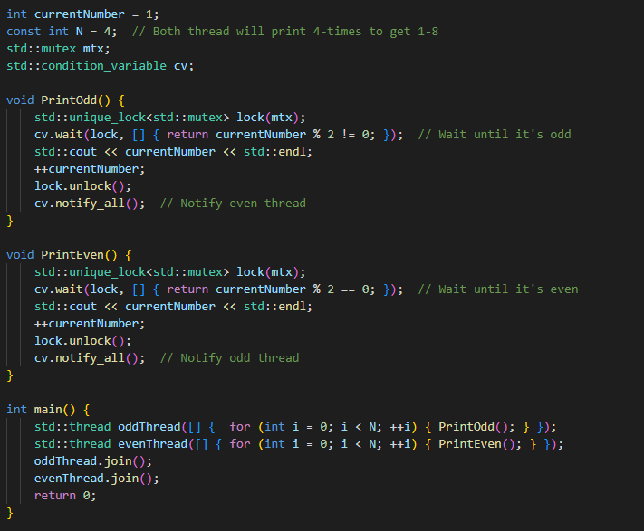

                          
                          

could there be throw in constructor?
ChatGPT
Yes, constructors in C++ can throw exceptions. If an exception is thrown within a constructor, it indicates that an error has occurred during object initialization. If the exception is not caught, the object is considered not to have been successfully constructed, and its destructor will not be called. This is particularly important in resource management, where you might have acquired some resources before the exception was thrown. In such cases, you should ensure that any acquired resources are properly released before the exception is propagated further, to avoid resource leaks.

Here's a simple example:

cpp
Copy code
class MyClass {
public:
    MyClass() {
        if (someCondition) {
            throw std::runtime_error("Initialization failed");
        }
    }
};
In this example, if someCondition is true, the constructor throws a std::runtime_error. If this exception is not caught when an object of MyClass is instantiated, the program will terminate (or the exception must be caught by the caller).

It's crucial to handle exceptions thrown by constructors, especially when dealing with dynamic memory allocation or other resource management, to ensure that there are no leaks or undefined behaviors.

Which modifier should be used for the function f() so that the following
code compiles:
class B
{
public:
  void  f(){ printf("B:f()"); }
};

void Do()
{
  B::f();
}

•  no modifier is necessary, the code is correct
•  inline
•  static
•  unsure

2.  What would be the output after executing the function f()?
class Parent
{
public:
    virtual void f(){ printf("Parent:f "); }
};

class Child : public Parent
{
public:
  virtual void f(){ printf("Child:f "); }
};

void f1(Parent p) { p.f(); } 
void f2(Parent* p) { p->f(); } 
void f3(Parent& p) { p.f(); } 

void f()
{
  Child c;
  f1( c ); f2( &c ); f3( c );
}

•  Child:f  Child:f Child:f
•  Parent:f  Parent:f Parent:f
•  Parent:f  Child:f Child:f 
•  Parent:f  Child:f Parent:f
•  unsure

3. What will happen when the function Do() is executed?
struct ExcType1
{};

struct ExcType2
{};

class A
{
public:
  ~A() { throw ExcType1(); }
};

void Do()
{
  try
  {
    A a;
    throw ExcType2();
  }
  catch( ExcType1& )
  {
    printf( "ExcType1 ");
    exit(1);
  }
  catch( ExcType2& )
  {
    printf( "ExcType2 ");
    exit(2);
  }  
  printf( "… but Continue");

}

•  "ExcType2 … but Continue" will be printed to output
•  "ExcType1 … but Continue" will be printed to output
•  "… but Continue" will be printed to output
•  the application will be terminated
•  unsure

4. What will happen when the function Do() is executed?
class A
{
public:
  A(): _d( 1 ) { memset( this,  0, sizeof( A ) ); }
  virtual void f(){ printf("%d", _d); }
private:
  int _d;
};

class B : public A
{
public:
  virtual void f(){ printf("123"); }
}

void print(A* pA)
{
  pA->f();
}

void Do()
{
  A* pA = new A();

  pA -> f();
}

•  "1" will be printed to output
•  "0" will be printed to output
•  the application will be terminated
•  unsure

5. What will the function Do() return? 
struct A
{ 
  void f() { printf("A"); };
};

struct B : public A
{
  void f() { printf("B"); }
};

struct C
{
  void f() { printf("C"); };
}

bool Do()
{
  C* p_a = new C(); 
  if (B* p_b = dynamic_cast<B*>(p_a)) 
    return true; 
  else
    return false; 
} 

• true
• false 
• the application won’

std::mutex m1;
std::mutex m2;

void f1()
{
  m1.lock();
  m2.lock();
}

void f2()
{
  m1.lock();
  m2.lock();

}

  

